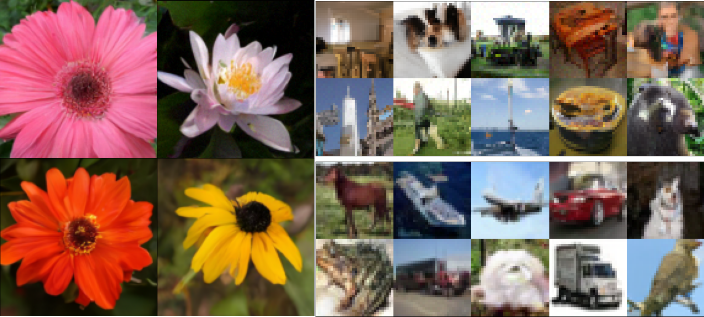
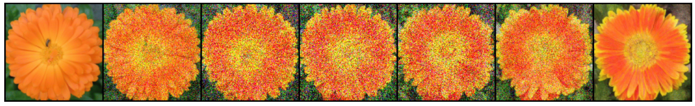
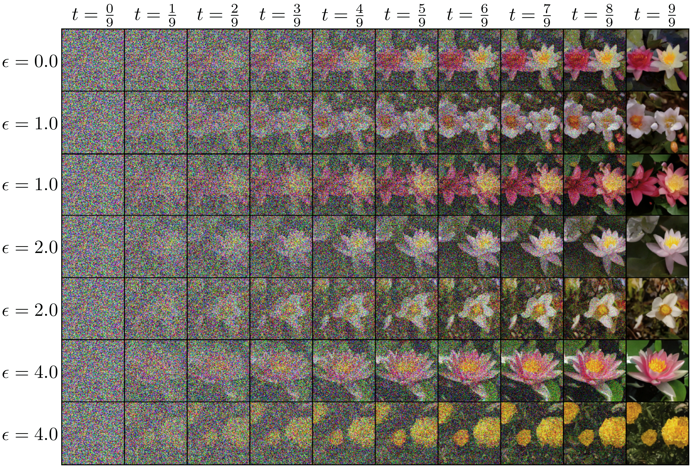

# stochastic-interpolants





This repository provides a very simple implementation of the stochastic interpolant method of [Building Normalizing Flows with Stochastic Interpolants](https://arxiv.org/abs/2209.15571) and [Stochastic Interpolants: A Unifying Framework for Flows and Diffusions](https://arxiv.org/abs/2303.08797). Author contributions are equal and not reflected in the commit history; the code was primarily developed in a private repository before public release. 

The intent of this repository is to provide the reader with an interactive tool to understand the mechanisms of the framework, as well as to reproduce any figures in [2].

A demonstration notebook for defining an interpolant $x_t = I(t, x_0, x_1) + \gamma(t) z$ 
and learning the associated velocity fields $b(x, t)$ and $s(x, t)$ (the score function) 
can be found in `notebooks/checker.ipynb`. This can be done with a score function model $s(t,x)$ or a denoiser model $\eta(t,x)$, which is related to the score via: $\eta(t,x) = -\gamma s(t,x)$ for two-sided interpolants and $\eta(t,x) = -\alpha s(t,x)$ for one-sided.

Another demonstration is available to do **mirror interpolation** from a dataset to itself, whereby a diffusion can be learned that resamples the distribution! The interpolant here is $x_t = x_0 + \gamma(t) x_1$, where $x_0 \sim \rho_{data}$.



An exploratory script based on exact, analytically computed $v(x, t)$ and $s(x, t)$ for the
case where $\rho_0$ and $\rho_1$ are both Gaussian mixtures can be found in `interflow/gmm.py` and `notebooks/gmm.ipynb`.

ODE and SDE integrators (ODE based on `torchdiffeq`, SDE hand-written), as well an interpolant class, are provided in `interflow/stochastic_interpolant.py`

With these tools, we are free to do simulation free generation from either deterministic or stochastic dynamics, with variable level of noise:




### If you use this code for some purpose, please cite:

```
@inproceedings{
albergo2023building,
title={Building Normalizing Flows with Stochastic Interpolants},
author={Michael Samuel Albergo and Eric Vanden-Eijnden},
url={https://arxiv.org/abs/2209.15571},
booktitle={The Eleventh International Conference on Learning Representations },
year={2023},
}
```

```
@misc{albergo2023stochastic,
  doi = {10.48550/ARXIV.2303.08797},
  url = {https://arxiv.org/abs/2303.08797},
  author = {Albergo, Michael S. and Boffi, Nicholas M. and Vanden-Eijnden, Eric},
  title = {Stochastic Interpolants: A Unifying Framework for Flows and Diffusions},
  publisher = {arXiv},
  year = {2023},
}

```

#### Please also consider citing these two related works by Liu et al 2022 and Lipman et al 2022:

```
@inproceedings{
liu2022,
title={Flow Straight and Fast: Learning to Generate and Transfer Data with Rectified Flow},
author={Xingchao Liu and Chengyue Gong and Qiang Liu},
booktitle={The Eleventh International Conference on Learning Representations },
year={2023},
url={https://openreview.net/forum?id=XVjTT1nw5z}
}
```

```
@inproceedings{
lipman2022,
title={Flow Matching for Generative Modeling},
author={Yaron Lipman and Ricky T. Q. Chen and Heli Ben-Hamu and Maximilian Nickel and Matthew Le},
booktitle={The Eleventh International Conference on Learning Representations },
year={2023},
url={https://openreview.net/forum?id=PqvMRDCJT9t}
}
```

